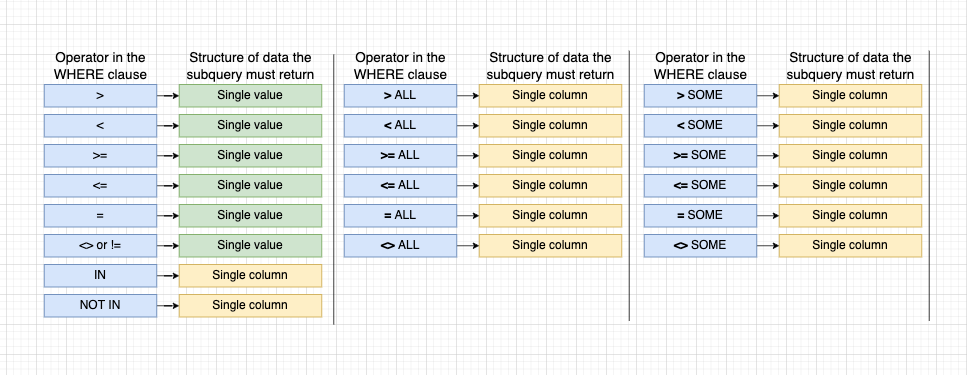

# Overview

> Database is used to store information , data is either persisted in memory / files and retrive data whenever required

## Data base design (List of large cities)

> Process of designing a db

1. What kind of thing are we storing?

   > List of **CITIES**

   > This will be a table ( a collection of records)

2. What properties does thing we have?

   > each city will have country ,cityname population and area

   > Propties are used to create columns in the table

3. What type of data does each of those properties have ?

   > city name and country name will be string

   > population and area will be integer
   > Each column will store a very specific data of a specific data type

## Creating a table

- `CREATE TABLE cities(name VARCHAR(50),country VARCHAR(50) population INTEGER, area INTEGER);`

- **CREATE TABLE** is **_keyword_** and keywords should always be **CAPITALIZED**

- **cities** is a **identifiers** and identifiers can be both lower and uppercase

## Insert Data into Table

> To insert into a table list out all the coolums you want add and the way you add data into column shoud be in the same order of the table colum order

- `INSERT INTO cities(name,country,population,area)`
  `VALUES('TOKYO','JAPAN',555555555555,7848525);`

- `INSERT INTO cities(name,population,country,area)`
  `VALUES('TOKYO','JAPAN',555555555555,7848525);`
- Population will be JAPAN
- **_ORDER IS IMPORANT_**

### INSERT Multiple rows in a sigle Query

- `INSERT INTO cities (name, country,population,area)`
  `VALUES ("INDIA","DELHI",4541522482,544444),`
  `VALUES ("SHANGHAI","CHAINA",24154114,54454);`

## Retrieve data from Table

- `SELECT * FROM table`

  `SELECT column names in anyorder seperated with comma FROM table`

## Process data before we can retrieve data

- Population density=population/area
- `SELECT name, population/density FROM cities`
- population/density will create a imaginary column in the db's
- Integer range 2.14Billion

## CREATE a imaginary column

- `SELECT name, population/ density AS peoplepersqkm FROM cities`

## Operations on STRINGS

1. CONCAT()
2. LENGTH()
3. UPPER()
4. LOWER()

## FILTER records

### WHERE

- `SELECT name, area FROM cities HWERE area>4000`
- T0 understand what happends when this query hits db engine
  it divides the query into parts and executes them in a order

  like this

  1.  FROM cities
  2.  WHERE area > 4000
  3.  SELECT name, area

### Comparison operators used with WHERE

- **SQL fact** comparison is done for evry row

1. = _are values equal_
2. `>` _is value of the left greater_
3. < _is value on the left lesser_
4. =>
5. IN _Is value present in the list_
6. <=
7. <> _are the values not equal_
8. != _same as above_
9. BETWEEN _range_ ex(`area BETWEEN 2000 AND 4000`)
10. NOT IN _is the not present in the list_

- EX: `SELECT * FROM cities WHERE area BETWEEN 2000 AND 8000`
- EX: `SELECT * FROM cities WHERE name IN ('DELHI','TOKYO')` Here we are saying is give me every record where name in record includes any on the names listed in IN
  EX: `SELECT * FROM cities WHERE name NOT IN ('DELHI','TOKYO')` Here we are saying is give me every record where name in record dosent include any of the names listed in IN

### MULTIPLE COMPARISON

> To do a multiple comparison we use the AND operator and the OR operator

- EX `SELECT * FROM cities WHERE area NOT IN(1200,8000) AND name!='DELHI`. Here we saying give me all the records where area is not 1200 and area is not 8000 and the name in that record should not be delhi

- EX `SELECT * FROM cities WHERE area NOT IN(1200,8000) OR name='DELHI`. Here we saying give me all the records where area is not 1200 and area is not 8000 or the name in that record should be delhi

- `SELECT name, manufacturer FROM phones WHERE manufacturer= 'Apple' OR manufacturer='Samsung'`
- `SELECT name, manufacturer FROM phones WHERE manufacturer IN ('Apple','Samsung')`

## UPDATING Records

- `UPDATE cities SET population=100 WHERE name='Tokyo';`

> SET will update the column value with the assigned value

## DELETING Records

- `DELETE FROM tablename WHERE condtion to specify that record`
- EX : `DELETE FROM phones WHERE manufacturer='Samsung';`

# DATABASE Design.

- TABLE for USERs
- TABLE for PHOTOS
- TABLE for COMMENTS
- TABLE for LIIKES
  `SQL Schema upvote downvote system`

# Types of Relationship

## One to Many and Many to one

1. A user has many photos `ONE to MANY R/S`

   - A Photo has many comments `ONE TO MANY R/S`
   - Boat can have many crew members
   - School can have many students
   - Company can have many employees

2. **VERY IMPORTANT** The many side of a relatioship will get the foreign key column from one table.
   - Comments table will have foreign key from photo table
   - Crew members table will have foreign key from boat table

## One to One

A One to one relationship table is similar to one to many r/s table, the key differnce is **_A One to one R/S table will have unique foriegn key where as a one to many r/s table will not have unq foriegn keys_**

1. A Boat can have one Captain (In captain table, boat fk will be added but that fk will be comletely unq to the table, it means a boat of x can only have y captain)
   - A Company and can have one CEO
   - A Country can have one Capital
   - A Person can have only one aadhar no

## Many to Many

1. Many students attends many classes
   - A task has many engg and a single engg can be working on many taks
   - A game can have many players and there many matches having many players
   - A movie an have many actors and actor can also act in many movies

## Primary keys

- used to identify the individal record in the table and it will be unq in the table

## Foriegn Key

- Relate a record from one table to another table
- `boat_id INTEGER REFERENCES boats(id)`
- nameofcol datatye REFERENCES tableName(columnName)

### CONSTRAINTS

1.  photo has a r/s with user which dosent exits **WILL THROW ERROR**

2.  Photo has r/s with user but user deleted his accounts

    - DELETE his photos
    - Store photos and rreplace relation id FK with NULL
    - which says this photo belongs to noone.

3.  DELETE

    - ON DELETE RESTRICT will throw error
    - ON DELETE DONOTHING WILL THOW ERROR
    - ON DELETE CASCADE delete all data w.r.t to that user
    - ON DELETE SET NULL set null in fk place
    - ON DELETE SET DEFAULT SET SOME DEFAULT VALUE

    EX:

          CREATE TABLE threads (
          id SERIAL PRIMARY KEY,
          title VARCHAR(50),
          body VARCHAR(5000)
          );

          CREATE TABLE replies (
          id SERIAL PRIMARY KEY,
          body VARCHAR(150),
          thread_id INTEGER REFERENCES threads(id) ON DELETE CASCADE
          );

# JOINS & AGGREGATION

- JOINS produces values by merging rows from tables
- use a join when asked to find data that involves mutiple resources

- Aggregations llok at many rows to find out a value
- for ex: Avg, most, least these words are a sign that you should use aggregation

### For each comment , show the content of the comments and the username who wrote the comment,

> `SELECT contents, username FROM comments JOIN users ON users.id==comments.user_id`

> `SELECT username,contents FROM users,JOIN comments users.id=comments.user_id`

- First FROM users will run
- then another table will be joined with users
- a condition users.id= comments.id
- from result give only username and content

- `SELECT contents,url FROM comments JOIN photos ON comments.photo_id=photos.id`

## JOIN alternate syntax

1. Table order between **FROM** and **JOIN** frequently makes a diff

   - FROM comments first we are taking comments table and JOINING phtots table

2. we must give context if column names collide

   - `SELECT photos.id,comments.id FROM comments JOIN phtots ON comments.photo_id=photos.id`

   - `SELECT photos.id AS PID,comments.id FROM comments JOIN phtots ON comments.photo_id=photos.id`

   - `SELECT P.id AS P_id,comments.id FROM comments JOIN phtots AS P ON comments.photo_id=P.id`

3. The above join will not give data which is not related to any user

## Types of JOINS

> Default join is a INNER JOIN

1.  INNER JOIN. ( Give me all the rows where condition is true)
2.  LEFT OUTER JOIN (Give me all rows from left table and only rows from right table where condition is true)
    - if anything from photos table is not matching from users table we are not going to drop it off
    - ex; photos not related with any user
    - if a photo has null then that row will be included and the values for other rows will be filled with NULL
3.  RIGHT OUTER JOIN (Give me all rows from right table and only rows from left table where condition is true)
    - if anything from users table is not matching from photos table we are not going to drop it off
    - ex; if a user has no photos
    <!-- - if a uf   has null then that row will be included and the values for other rows will be filled with NULL -->
4.  FULL JOIN. (Give me all rows from both table whether condition is true/false)
5.  ORDER of table matters **_IMPORTANT_**
6.  FROM JOIN WHERE is should be used to filter out joined data not FROM WHERE JOIN

## THREE WAY JOIN

> JOIN 3 DIFFERENT TABLES

- comments has photo_id and user_id fk
- phtos has user_id fk
- comments.user_id=photo.user_id=users.id
  `SELECT * FROM comments JOIN photos ON photos.user_id=comments.user_id JOIN users ON photos.user_id=users.id AND comments.user_id=user.id`

  `SELECT title,name,rating FROM reviews JOIN books ON reviews.book_id= books.id JOIN authors ON reviews.reviewer_id=authors.id AND books.author_id=authors.id;`

# GROUPING and AGGREGATES

## GROUPING

> Reduces many **rows** down to **fewer rows**. Done by using **GROUP BY** keywords.

> GROUP BY find all the unqiue values and take each row and assign it a different group by user_id,

> IN SIMPLER WORDS,

- first, group by column will find all the unq values in that column.
- then, all the duplicates values of that column will be grouped under that one column
- the catch is, your are only allowed to select groupped column not the underlying column, u can only access them by using aggegate func()

> `UNIQUE USER ID | id | content | user_id | photo_id`

- `SELECT user_id FROM comments GROUP BY user_id`
- **VERY IMPORTANT**`SELECT name FROM phones GROUP BY manufacturer;`.
  > The above query will result in an error bec we are directly selecting a unnderlying column instead of a grouped column

## AGGREGATES

1.  MAX(columnname)
2.  SUM(columnanme)
3.  COUNT(columnanme) return no of values
    - null values are not count by default
4.  MIN(columnanme)
5.  AVG(columnanme)
    **Only aggregate function can access underlying column of a groupped column**

> > ## **_WHY?_**

> While using aggregate function on select and other columns will throw err

       - for ex: `SELECT SUM(revenue) FROM balancesheet  `
        - for ex: `SELECT SUM(revenue),name from balancesheet`

> Reduces many **VALUES** down to one

> Done using **Aggregate** functions

## Sorting

**ORDER BY** columnName default **ASC** optionally we can use **DESC**
ORDER BY two columns

ex `ORDER BY column1, column2` column2 will be sorted based on column1 like having duplicate values will sort column2
ORDER BY can also sort **Alphabetically**

## OFFSET

Skip some no of rows from the result
`OFFSET 2`;

## LIMIT

Limit the no of records from the result.
`LIMIT 2` showing top two scorers etc...

## SET OPERATORS

> JOIN two different sets of data the catch is both data sets must have same columnName with same datatype

### UNION

- JOIN together the results of two queries and remove duplicate data
  `(Query1) UNION (Query2)`
- Ex: Olympic games winner from last year and this year

### UNION ALL

- dosent remove duplicate unions

### INTERSECT

- Find the common rows in the results of two data sets Remove duplicates

### EXCEPT

- Find the rows that are present in first query but not present in second query so if any common value exist in 2nd query the common row from query 1 will be deleted

### INTERSECT and EXCEPT ALL

- Dosent remove duplicates

> > ### **_What is the difference b/w UNION & INTERSECT_**

## SUB QUERIES

> query>(sub query)

- a sub query will run first and then the later query

- while writing sub query **_it is important to know what will be returned from the query_**
- they donot have semicolon at the end of sub query

### Sub query in a SELECT clause

> **IMPORTANT** while writing **_a subquery in select make sure the subquery returns only a single value_**

- a subquery that returns a single value can be used inside of a select statment
- fo ex: `select name, price , price/(select max(price) from phones) as price_ratio from phones;`

### Sub query in a FROM clause

for ex: `select name , price_ratio from (select name, price/weight as price_ratio frpm phones) as p where prce_ratio > 5`

> **_The sub query in a from clause must return a table like structure it should have all the columns from select_**

- The outer select must be compatible by the result of the subquery executed in FROM clause
- Sub query in FROM must have an alias (as P)

### Sub query in a JOIN clause

> Any subquery that returns data compatible with the **ON** Clause
> LIST of OPERATOR used in WHERE clause
> can retrun single column values

### Sub query in a WHERE clause

> Ex: Give me all the department where unpaid students are there
