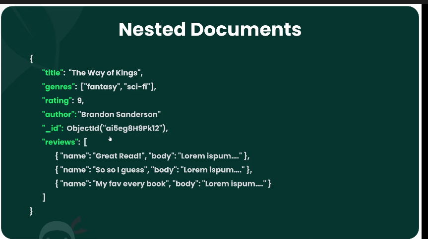

# Collections

Collections are table in NoSql and a database can have as many collections as possible.

A user collection would store data and that data is referred as a document in Nosql, in SQL it would be a ROW

Documents represent a record.
Data inside document will be in JSON format

Every document will be have a unq id by default

A document can have properties whose values themselves can be a document called as nested document. (nested array of documents)

## Spin Mongo shell

1. `mongosh` step into shell
2. `cls` clear the screen
3. `exit` exit the db shell

## Commands

1. `show dbs` lists all dbs
2. `use dbName` switch and uses to that db ( also creates a db)
3. `show collections` list all the collections.
4. `db` tells which db you are currently in.
5. `db.books` create a collection in the db
6. `db.books.insertOne({title:"AA",Author:"a",pages:300,rating:7,genres:["Fanatasy"]})` adds a document inside that collection
7. `db.collectionName` creates a new collection inside that db

## Insert Docs

8. `db.collectionName.insertOne({})` will create a new collection and insert a doc into that collection.
9. `db.books.insertMany([])` used to insert many documents at once

## Find Docs

10. `db.collectionNAme.find()` lists out first 20 documents inside the db
11. `db.collectionName.find().pretty()` this will make the outcome/result formatted.
12. `it` to get next 20 after the command has complete it stands for iterate
13. `db.books.find({author:"ALI"})` it finds all the dopcumnets in the db where author is ALI
14. `db.books.find({author:"ALI",rating:5})` it finds all the documents where author is ali and rating is 5
15. `db.books.find({filter},{what to retrieve from that filtered data (projection)})`
    ex:
    `db.books.find({author:"ALI"},{title:1,rating:1})`
    `db.books.find({},{title:1,author:1})` only get title and author from all documents.
16. `db.books.findOne({_id:ObjectId(value)})`
17. `db.books.find().count()` counts the number of books
18. `db.books.find({author:"ALI"}).count()` counts the number of books written by ali
19. `db.books.find().limit(3)` limits the number of results to 3
20. `db.books.find().sort({title:1})` gets all the documents and sorts all the documnets w.r.t title value in asc.
21. `db.books.find().sort({title:-1})` gets all the documents and sorts all the documnets w.r.t title value in desc.

## Deleting Documents

1. deleteOne()

   ```js
   db.books.deleteOne({ _id: "ID" });
   ```

   The field id can be any field, but id is the best to use.

2. deleteMany()

   ```js
   db.books.deleteMany({ author: "Shahed" });
   ```

   The will delete all books whose author was Shahed

   ```js
   db.books.deleteMany({ author: { $in: ["ali", "rizwan"] } });
   ```

   the operation will delete all the books where author is eiter ali or rizwan

## Update

1. updateOne()

   ```js
   db.books.updateOne({ whichBookToUpdate }, { $set: { rating: 5 } });
   db.books.updateOne({ _id: "ID" }, { $set: { rating: 5, pages: 360, title: "NEW NAME" } });
   ```

   This operation will find the book by that id and will update the rating and pages value of that book only.

2. updateMany()

   ```js
   db.books.updateMany({ author: "autnorName" }, { $set: { authorName: "authorname" } });
   ```

   this operation will find all the books writtebn by author name and update the anuthorName field by the value

   ```js
   db.books.updateMany({}, { price: 999 });
   ```

   This operation will update all the books with price of 999

3. update()
   ```js
   db.books.update({_id:"ID",{title:"HELLO",page:500}})
   ```
   This operation dosent require the `$set` to update the fileds, just add the fields and current value will be updated and others will be removed.
4. replaceOne()

   ```js
   db.bboks.replaceOne({id:"ID"},{new Data obj})
   ```

   This operation will remove all the previous data related with that id with a new data

5. updateMany()

6. Increment Operator

   ```js
   db.books.updateMany({ author: "autnorName" }, { $inc: { pages: 2 } });
   ```

   this operation will find all the books written by authoranme and increment the pages value 2 and updates it

7. Decrement operator

   ```js
   db.books.updateMany({ author: "autnorName" }, { $inc: { pages: -2 } });
   ```

   this operation will find all the books written by authoranme and decrement the pages value 2 and updates it

8. Pull operator (can pull one only)

   ```js
   db.books.updateOne({ _id: "ID" }, { $pull: { genres: "fantasy" } });
   ```

   This operation will remove fantasy value from the array inside the id document.

9. Push operator (can push one only)

   ```js
   db.books.updateOne({ _id: "ID" }, { $push: { genres: "fantasy" } });
   ```

   This operation will add "fantasy" value from the array inside the id document.

10. Each Operator (can add/remove multiple at once)
    ```js
    db.books.updateOne({ _id: "ID" }, { $push: { genres: { $each: ["a", "b", "c"] } } });
    ```
    This operation will a,b,c to the generes field on the id document

## Nested documents


Nested documents can improve read performance as youdont need to issue two commands to get data from two table (reviews and books)
Each document can be nested 100 levels deep and a document size cannot exceed 16mb.
ex:

```js
db.books.insertOne({
  title: "Book Title",
  author: "Author Name",
  rating: 8,
  genres: ["N Number of genres"],
  pages: 400,
  reviews: [
    {
      name: "reviewerName",
      review: "Some chars about reviews",
    },
    {
      name: "reviewerName",
      review: "Some chars about reviews",
    },
    {
      name: "reviewerName",
      review: "Some chars about reviews",
    },
    {
      name: "reviewerName",
      review: "Some chars about reviews",
    },
  ],
});
```

If you want store only lates 5 reviews

## Operators and queries $ -> ATOMIC Operators

**$gt**

1. ```js
   db.books.find({ rating: { $gt: 7 } });
   ```
   this operation find all books in the collection whose rating is greater than 7, not including.

**$lt**

1. ```js
   db.books.find({ rating: { $lt: 7 } });
   ```
   this operation finds all the documents whose rating is less than 7, not including.

**$gte**

1. ```js
   db.books.find({ rating: { $gt: 7 } });
   ```

   this operation find all books in the collection whose rating is greater than or equal to 7, not including.

**$lte**

1. ```js
   db.books.find({ rating: { $gt: 7 } });
   ```

   this operation find all books in the collection whose rating is less than or equal to 7, not including.

2. ```js
   db.books.find({ rating: { $gte: 6 }, author: "Shahed Ali" });
   ```

   find all the books where author is shahed ali **AND** rating is greater than or equal to 6.

**$or**

1. ```js
   db.books.find({ $or: [{ rating: 7, rating: 9 }] });
   ```

   finds all the books where rating to the books is 7 or 9.

2. ```js
   db.books.find({ $or: [{ rating: 5, author: "Shahed Ali" }] });
   ```

   finds all the books where book has a rating of 5 **OR** book author is SHAHED Ali.

3. ```js
   db.books.find({ $or: [{ pages: { $lte: 300 } }, { pages: { $gte: 400 } }] });
   ```
   find all the books where pages less than equal to 300 **OR** pages greate than equal to 400.

**$in**

1. ```js
   db.books.find({ rating: { $in: [7, 8, 9] } });
   ```

   finds all the books in the collection where the value of rating is present **in** given array

   This can also be written

   ```js
   db.books.find({ $or: [{ rating: 7 }, { rating: 8 }, { rating: 9 }] });
   ```

**$nin**

1. ```js
   db.books.find({ author: { $nin: ["Shahed", "Ali"] } });
   ```
   this will find all the bokks where author name is not shahed and ali

## quering nested arrays

1.  ```js
    db.books.find({ genres: "fantasy" });
    ```

    This operation finds all the books in the collection where fantasy is present inside the genres array and **it will not be exact match**

    to get exact match.

    ```js
    db.bboks.find({ genres: ["fantasy"] });
    ```

2.  find more options inside the array and only give those documnets

    ```js
    db.books.find({ genres: ["fantasy", "biography"] });
    ```

## quering nested array of objects

1. ```js
   db.bboks.find({ "reviews.name": "shahed" });
   ```
   - note the quote arround key
   - while quering for values inside the nested array of objects use
     dot notation `reviewers.name`

## Driver

- `npm i mongodb`

## Connect to mongodb from local

```js
const { MongoClient } = require("mongodb");
let dbConnection;
function connectToDB(cb) {
  MongoClient.connect("mongodb://localhost:27017/dbName")
    .then((client) => {
      // client represent the client we have created
      dbConnection = client.db(); // returns a db connectiomn
      return cb();
    })
    .catch((err) => {
      console.log(err);
      return cb(err);
    });
}
function getDB() {
  return dbConnection;
}
```

## How mongo works

Your drivers/mongo shell talk to mongodb server, this server then talks to storage engine to communicate (read/write) to the files.

When storage engine write and reads data it loads that data in memory and write the data into files (HDD)

Data stored inside the db is in **BSON** fromat

> BSON => Binary JSON
> The reason to store BSON data is more efficient
> and to support other data types
> suchas Object, bigInt etc...
> Helps in omiting quotes for key names unless key contains empty spaces

In Mongo db there is no need to store same type of data in a collection.

Two different documents inside a collection can have two differnt schema's

## CRUD


## find cursor

Find by default will not give all doc bny default, it will give the first 20

```js
db.passengers.find().forEach(document=>{clg(document)})\\
```

Even loop will get data when you reach the last one

## Projection

Filter the data with find and send only the data you need to send.
ex: names of every student who passed (not his marks, height,weight,etc)

`db.students.find({},{name:1})` this operation will find all the documents and only give the name from all the documents

## File relations

## How to find nested object from findMany({},{nestedObject})
