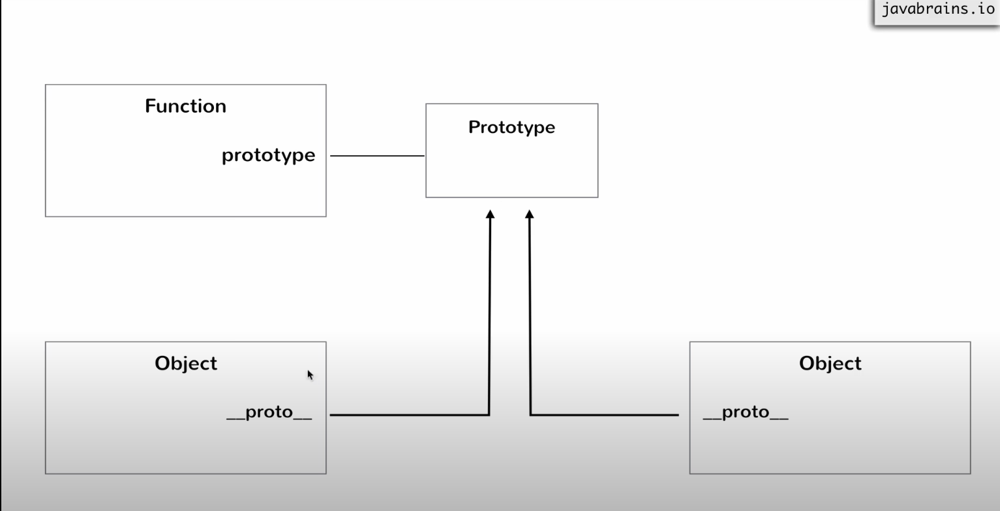
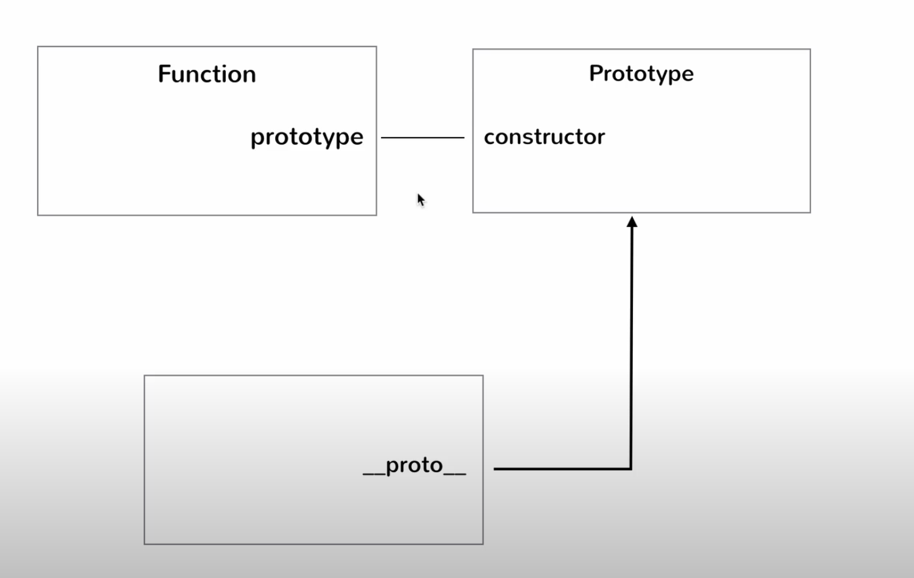
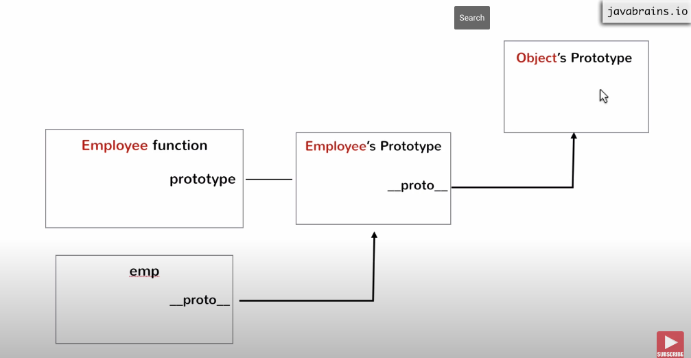
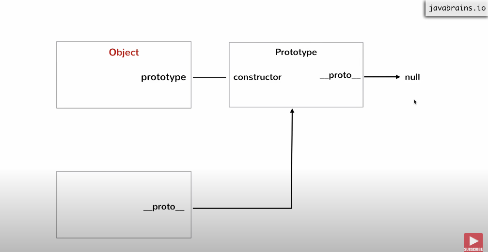
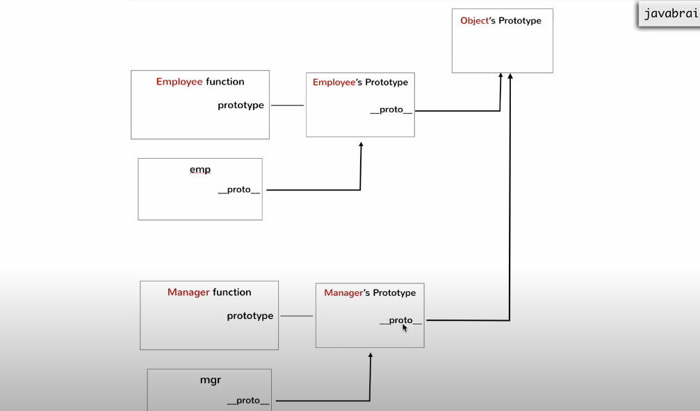
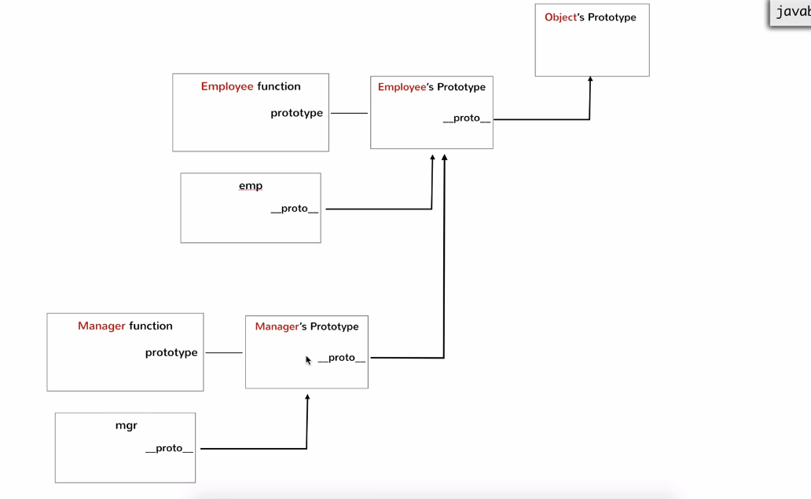

# Prototype

A Function called with a `new` keyword will create an empty object with `this` and return `this` object by default

A Function initiated by `new` keyword will tell javascript that the function invoked is a constructor function

A Constructor function by convention should start with a Capital Letter.
A Constructor function initiated without new keyword will have a return value of `undefined`

```js
function employee(name, age, designation, salary) {
  this.name = name;
  this.age = age;
  this.designation = designation;
  this.salary = salary;
}
```

## Understanding this

### Different ways executing a function

1. calling a normal func()
2. calling a function decalred inside a obj
3. calling a func with new keyword
4. functonNAme.call()

## Execution context

JS func execution depends on the way a func is invoked
There is an implicit argument to any js func() is `this` keyword
`this` is pointing to something

This reference

- Execution context 1

```js
function foo() {
  console.log(this);
}
foo();
```

In this function execution the value of `this` is the global object which depends on the runtime enviorment
window in browser
gloabl obj in node
In simpler words, std function `this` refers to the global object

- Execution context 2

```js
var obj = {};
obj.foo = function () {
  console.log(this);
};
obj.foo();
```

In this context `this` refers to the object itself.

- Execution context 3

```js
function F	oo() {
  // var this={}
  this.a = a;
  this.b = b;
  this.c = c;
  //return c
}
new Foo();
```

In this context `this` refers to `{}`

## Call func()

Every js function has aproperty call which is used to invoke the function itself.
`foo.call()`
call func take a argument of object data type, it takes this object and binds the `this reference ` on the function
The use case is u can select which this to biond to the func

`mike.inflateTires.call(givetheObject : bind)`

## Prototypes

A concept of building objects using a blueprint
A prototype is equal class as we cannot create instances of prototypes

## Steps when js processcess a function

- Function a re objects in js
  and when a function is processed it created twi objects

1. The function itself
2. Object for prototype object

To access the function object type`functionName`
To access the prototype obj type `functionName.prototype`
Everyu prototype obj has a reference to `Prototype`
These steps happen for every function

## Constructor func

When you create a function with new keyword `__proto__` object and this `__proto__` is pointing to function declared (construtor)


## What is the use of prototype obj

Can be used to create inheritance
Ex:

```js
function foo() {}
foo.prototype.test = "Hello iam shahed Ali";

var newFoo = new Foo();
console.log(newFoo.__proto__.test);
```

When you refers to an key value pair in \_\_proto\_\_ and checks if its not present there and it goes up in hierarchy and check in proto until it reaches the top.

**IMPOTANT** Both \_\_proto\_\_ and proto are refering the same value in memory

You can directly access the functions declareed under prototype instead of doing func.**proto**.funcname
And the hierarichal look up happens at runtime

The manin differnce between Class and Prototype
In Class you need to define the blue print beofre creating any instances
But in Prototype method you can declare any other function at any time and all instances will have access to the method at runtime

## proto.constructor

A function has access to prototype method and the prototype mthod has a methood call constructor which points to the func itself
Ex

```js
var proto = foo.prototype;
console.log(proto.constructor); // The foo function itself
```

usecase

1. know which function created this method
2. create a function which has access to method `a`
   Ex:

```js
function foo() {}
var proto = foo.prototype;
foo.prototype.greet = function () {
  console.log("hello");
};
var a = new foo();
var b = new a.__proto__.constructor();
// while create b what we are saying is assign a function to "b" which created "a"
```

Proof

USING these are not recommended as
these are copies these are just references and if the main refernces changes we can introduce unitentional bugs

## The Object function

A global function available is named as Object which is of type function.

- `Object`
- `Object()`
- `var object={}`===`var obj=new Object()`
- obj.\_\_proto\_\_=Obj.\_\_proto\_\_

Every \_\_proto\_\_ points to higher one in hierarchy this one continues until it reaches the global `Object prototype`

And the `Objects protypes => \_\_proto\_\_` points to null


## Inheritance and multi-level Inheritance

### Inheritance



## Change \_\_proto\_\_ pointing reference

**_VERY IMPORTANT_**` m1.\_\_proto\_\_.\_\_proto\_\_=Employee.prototype`

### Multi level Inheritance


