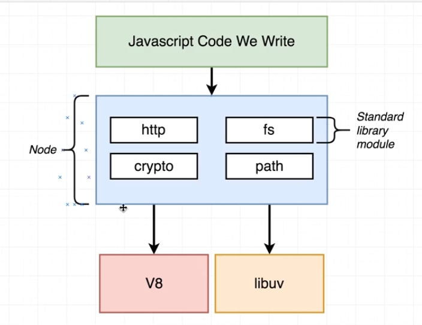

# Node

A runtime for js
Node.js is a c++ program with v8 embedded

## What does js need to manage servers?

1. Ways to deal with files
2. Ways to deal with database
3. Ways to communicated over the internet
4. Accept request and send responses in HTTP
5. Way to deal with work that takes long time']
   > And these things donot come out of the JS box
   > All of these are additions on top JS created by NODE

## How node modules work

Where you require the code you are actually invoking the code written in that file

> Require's are cached
> Encapsulation can be done using modules
> for ex

From the bove example secret key and hasPassword function has not been revbelaled to the user

## How node is made

In nodejs source code

- lib folder is all the JS defination, function , the js side of the project . JS World
- src folder, c++ implementation of those definations and function.
  In this folder node pull libuv, and v8 engine to run code.

## Every iteration of eventloop is called a TICK

## High throughput low latency socket servers.
